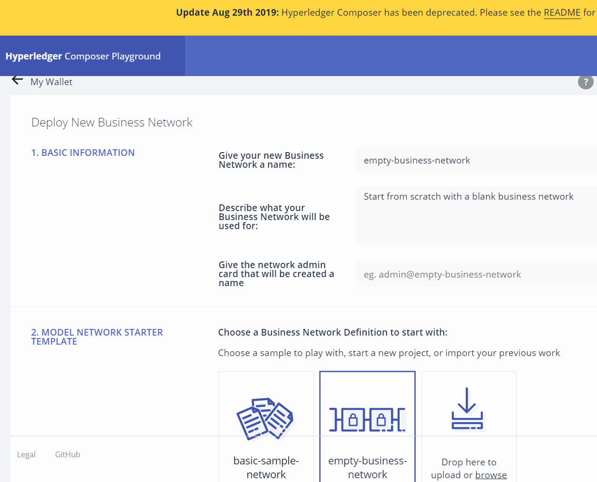
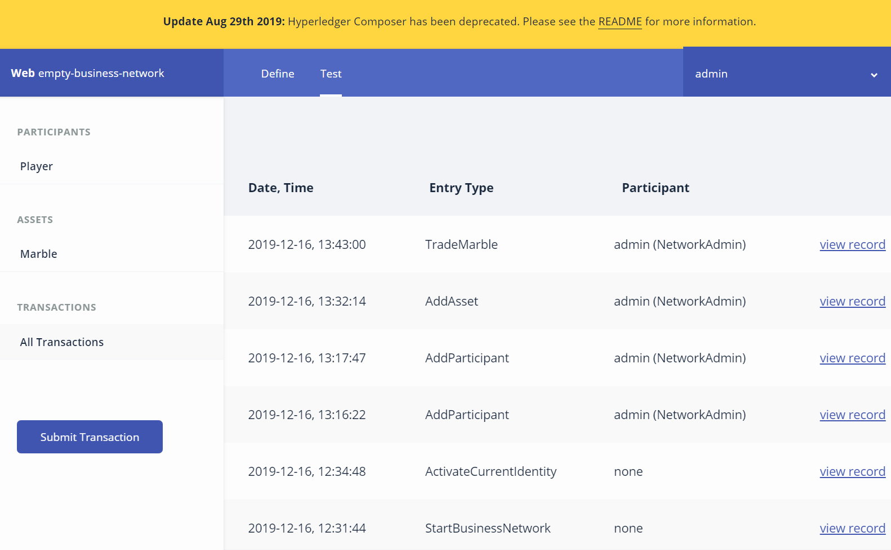

# Blockchain入門(実習の補足情報)

### 補足概要
- **Hyperledger Composerを利用したBlockchainの体験実習**
- 19/12/13に実習実施
- 講師（IBM株式会社 紫関様、西下様）
- [MDDSCデータ人材育成プログラム](https://md-dsc.com/curriculum31.php)の応用編
- **Hyperledger Composer(HC)は、2019年12月時点で非推奨(Deprecated)状態**です。
    - [非推奨の理由](https://stackoverflow.com/questions/57423380/what-are-reasons-for-the-deprecation-of-hyperledger-composer)がネットに掲載されています。
    - 幾つかのHCの機能がHyperledge fabric本体に吸収されました。
    - 使い易い他のソフトウェア候補が少ない事から、現在もデモ目的で使用されています。
- 本来はデフォルトとして存在していたプログラムコードが、Deprecatedにより一部消去されました。
   - 実習時に入力する必要があった部分が消去されています。該当コード部分を、下記に掲載いたします。
---

### 実習手順[1]　Embty-Business-Networkの準備

詳しい実習手順は講義中に紫関講師により解説されています。講義ビデオは、データ人材育成プログラムの[e-Learning教材](https://md-dsc.learning-ware.jp/
)で御確認下さい。

1. **Hyperledger Composerの起動**
   - https://hyperledger.github.io/composer/latest/ から「Try It Online」をクリックします。
2. **Let's Blockchainを選択** 
   - Welcome to Hyperledger Composer Playground!とポップアップ画面が出るので、「Let's Blockchain」ボタンを押下します。
3. **Deploy a new business networkを選択**
   - こんにちは、Hello, Composer!の右側の点線で囲まれている「Deploy a new business network」を選択します。
4. **empty-business-networkを選択, Deployを押下**
   - 「Deploy a new business network」の画面が現れます。
   - (1.BASIC INFORMATION)では、何もせずデフォルトのままにします。
   - (2.Model Network Starter Template)で真ん中の「Empty-business-network」を選択して、右側の「Deploy」ボタンを押下します。
   - 
5. **Connect nowを選択**
   - 左に「admin@empty-business-network」でUSER ID: adminのempty-business-networkが生成されるので、LINK状態になっている「Connect now」を押下します。
6. **Marble.zipデータファイルをダウンロードして解凍**する。
    - Marble.zipをe-Learningサイトからダウンロードして下さい。
    - Marble.zipを解凍して下さい。
    - Marbleディレクトリに「Marble.cto, Marble.js, permissions.acl」の3ファイルがある事を確認して下さい。
7. **Marble.ctoモデルファイルを追加**する。
    - 左画面の「UPDATE NETWORK」直上の「Ade a file」を選択する。
    - ポップアップ画面にModel File(Marble.cto)を流し込み「Add」ボタンを押下する。
8. **Marble.jsスクリプトファイルを追加**する。
    - 左画面の「UPDATE NETWORK」直上の「Ade a file」を選択する。
    - ポップアップ画面にScript File(Marble.js)を流し込む。
9. **permissions.aclアクセスコントロールファイルを追加**する。
    - 左画面の「UPDATE NETWORK」直上の「Ade a file」を選択する。
    - ポップアップ画面にアクセスコントロールファイル(permissions.acl)を流し込み、置き換えなら「Replace」ボタンを押下する。
10. 余分なModelファイルを削除する。 
    - Marble.cto以外の「model.cto」ファイル等を、左画面から選択してごみ箱マークを押下して削除（Delete）する。
    - 左画面は「About(README.md,package.json)」「models/Marble.cto」「lib/Marble.js」「permissions.acl」だけにする。
11. **左画面の下の「Deploy changes」ボタンを押下**する。
     - ボタンは灰色非選択状態になるが、そのままで大丈夫です。

---

### 実習手順[2]　ハンズオン基礎編：Marble1個の資産移動

- 構築したBlockchain上で、AbeさんとTrumpさんの間でMarble1個を受け渡し(=Assetの移転)をします。

1. 下記の**作業内容**の4～6番を行います。1～3番までは上記実習手順[1]7～9番(IBM社配布データをファイル読込)で対応済です。
   - 1. (Defineタブ)Model Fileの確認(Participantクラスの定義,Assetクラスの定義,Transactionクラスの定義)
   - 2. (Defineタブ)Script Fileの確認(Transaction Processor Functionの定義)
   - 3. (Defineタブ)Access Controlの確認
   - 4. (Testタブ)テスト用インスタンスの作成(Participantインスタンスの作成,Assetインスタンスの作成)
   - 5. (Testタブ)Transactionの実行
   - 6. (Testタブ)実行結果の確認(Assetインスタンスの確認)
2. Testタブで**PARTICIPANTSインスタンスをAbeさんとTrumpさん分の2個作成**
   - 左画面はPARTICIPANTS下の「Player」が選択状態になっている事を確認します。
   - Testタブを選択した画面を開き、**右上の「Create New Participant」ボタンを押下**してAbeさんとTrumpさんを追加します。
   - ボタン押下でのポップアップ画面のデフォルトは下記になっています。

```js
{
  "$class": "org.hyperledger_composer.marbles.Player",
  "email": "8169",
  "firstName": "",
  "lastName": ""
 } 
```

    - 1つ目のParticipantを下記の様に編集します。email,firstName,lastNameを書き換えます。
    
```js
{
  "$class": "org.hyperledger_composer.marbles.Player",
  "email": "Shinzo.Abe@mail.jp",
  "firstName": "Shinzo",
  "lastName": "Abe"
}
```

    - 2つ目のParticipantも「Create New Participant」から下記の様に編集します。
<code>
{
  "$class": "org.hyperledger_composer.marbles.Player",
  "email": "Donald.Trump@mail.us",
  "firstName": "Donald",
  "lastName": "Trump"
}
</code>

3.  Testタブで**ASSETSインスタンスを遣り取りするMarble1個分を作成**
    - 続いてTestタブを選択した画面のまま、左画面のASSETS下の「Marble」を選択します。
    - 左画面はASSETS下の「Marble」が選択状態になっている事を確認します。
　  - **右上の「Create New Asset」ボタンを押下**してSmall Red Marbleとを追加します。
    - ボタン押下でのポップアップ画面のデフォルトは下記になっています。
```
{
  "$class": "org.hyperledger_composer.marbles.Marble",
  "marbleId": "2222",
  "size": "SMALL",
  "color": "RED",
  "owner": "resource:org.hyperledger_composer.marbles.Player#7178"
}
```
    - marbleIdをデフォルト番号から「marble001」に変更します。
    - またownerの#以下を、デフォルト番号からAbeさんのメールアドレスに変更します。
    - 画面下の「Create New」ボタンを押下します。
```
{
  "$class": "org.hyperledger_composer.marbles.Marble",
  "marbleId": "marble001",
  "size": "SMALL",
  "color": "RED",
  "owner": "resource:org.hyperledger_composer.marbles.Player#Shinzo.Abe@mail.jp"
}
```

4.  **Marble001をTrumpさんに渡すTransactionを定義**する
    - 左画面ボタンで**Submit Transactionボタンを押下**する
    - 左画面のSubmit Transactionボタンを押下するとポップアップでTransaction編集画面になります。
    - ポップアップ画面のデフォルトは下記になっています。
```
{
  "$class": "org.hyperledger_composer.marbles.TradeMarble",
  "marble": "resource:org.hyperledger_composer.marbles.Marble#1655",
  "newOwner": "resource:org.hyperledger_composer.marbles.Player#3145"
}
```
    - Marbleの#以降は「marble001」に編集し、newOwnerの#以降はTrumpさんのメールアドレスに編集します。
    - ポップアップ最後の「Submit」を押下します。
```
{
  "$class": "org.hyperledger_composer.marbles.TradeMarble",
  "marble": "resource:org.hyperledger_composer.marbles.Marble#marble001",
  "newOwner": "resource:org.hyperledger_composer.marbles.Player#Donald.Trump@mail.us"
}
```
5. **BlockchainのMarble1個の資産移行手続きを確認**
    - ここでは、BlockchainのTransaction「AbeさんからTrumpeさんへのMarble1個遣り取り資産移行」の結果を確認します。
    - [5-1] **Transaction結果画面へ移動**
    - 左画面のTRANSACTIONSから「All Transactions」を選択します。 
    - 下記の画面の各STEPが、BlockchainのTransactionになっています。PARTICIPANTとしてAbeさんやTrumpさんが追加されたTransaction結果が、一番右の「View Record」をクリックするとBlockchainのTransactionの結果を確認する事が出来ます。
    - 
    - [5-2] Abeさんの**PARTICIPANT生成結果のTransactionを確認**する
    - ***timestampでTransaction生成時間の情報を保持しており、TransactionIdがハッシュ値で保存されている***事が判ります。(Blockchainでは、Hash値をチェーン構造で受け渡ししていきます。)
    
```
{
 "$class": "org.hyperledger.composer.system.AddParticipant",
 "resources": [
  {
   "$class": "org.hyperledger_composer.marbles.Player",
   "email": "Shinzo.Abe@mail.jp",
   "firstName": "Shinzo",
   "lastName": "Abe"
  }
 ],
 "targetRegistry": "resource:org.hyperledger.composer.system.ParticipantRegistry#org.hyperledger_composer.marbles.Player",
 "transactionId": "f074f13c-cc90-4b55-8ed2-8d81cead56f2",
 "timestamp": "2019-12-16T04:16:22.135Z"
}
```
```
```

    - [5-3] **Marble001のAbeさんからTrumpさんへの資産移動結果のTransactionを確認**する。
    - class,marble, newOwner以外に、transactionIdとtimestampが保存されている事が判ります。上記のAbeさんPARTICIPANT生成時も、同じ様にHash値が生成されていました。***Blockchainは、作業毎に以前のHash値を基に、次のHash値を生成する仕組みを持ちます。1つのTransactionを編集（改ざん）しようとすると、元のTransactionもHash値も辿って変更していく必要があるので、Blockchainは改ざんに頑健な仕組みと言われています***。
    
```
{
 "$class": "org.hyperledger_composer.marbles.TradeMarble",
 "marble": "resource:org.hyperledger_composer.marbles.Marble#marble001",
 "newOwner": "resource:org.hyperledger_composer.marbles.Player#Donald.Trump@mail.us",
 "transactionId": "2da9e1ff-75a2-4e76-82ab-42b622da0a3c",
 "timestamp": "2019-12-16T04:43:00.596Z"
}
```


---
- Textでは、Marble2個の遣り取りのプログラムコードも紹介されています。受講生の皆様から御希望があれば、Marble2個部のコードもこちらに掲載致します。
- まずはMarble1個遣り取りのBlockchain構築を楽しんで下さい。宜しくお願い申し上げます。
- ※上記教材は、神沼がIBM社資料を基に作成しました。Blockchain入門講師の紫関様、西下様に内容を確認して頂いております。

